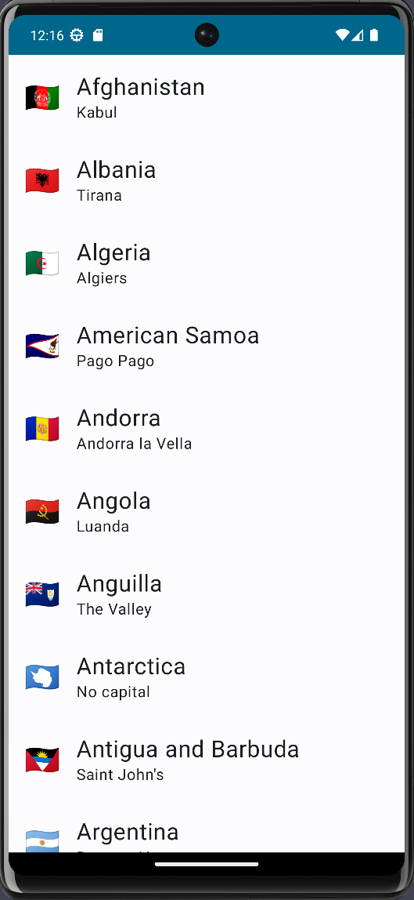
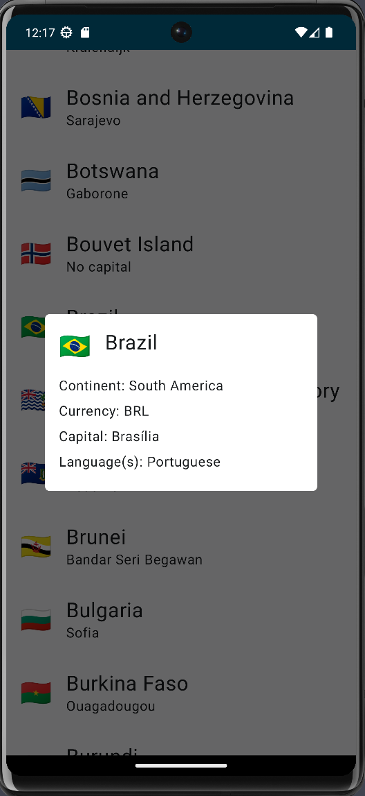

# Countries App with GraphQL

Android countries information app made with Jetpack Compose and GraphQL.

Countries information provided by [Apollo Countries API](https://studio.apollographql.com/public/countries/variant/current/home).

## Features

- Jetpack Compose UI.
- Dependency injection with Hilt.
- MVVM Architecture.
- Retrieves countries data from the network.

## Libraries

- Jetpack Compose
- Hilt
- Apollo
- ViewModel

## Result

|  |  |
|---------------------------------------|:-----------------------------------:|
